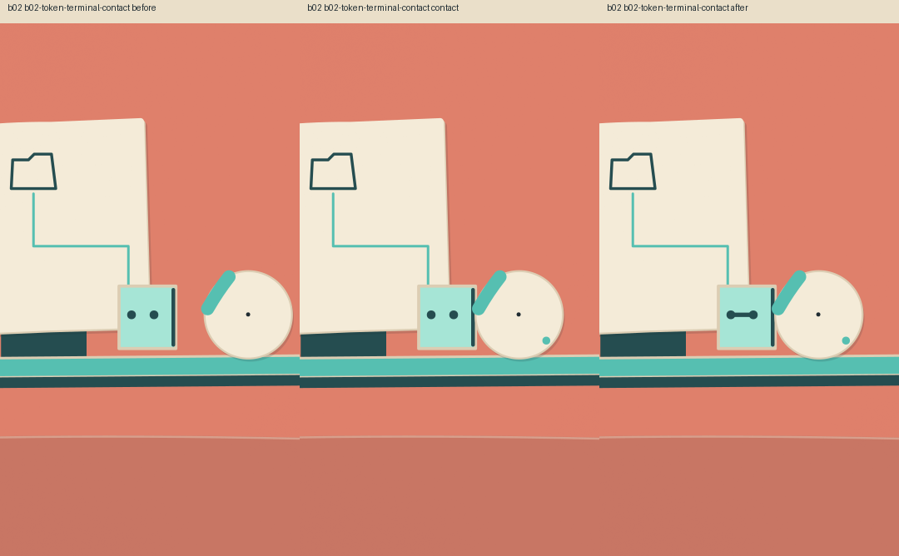
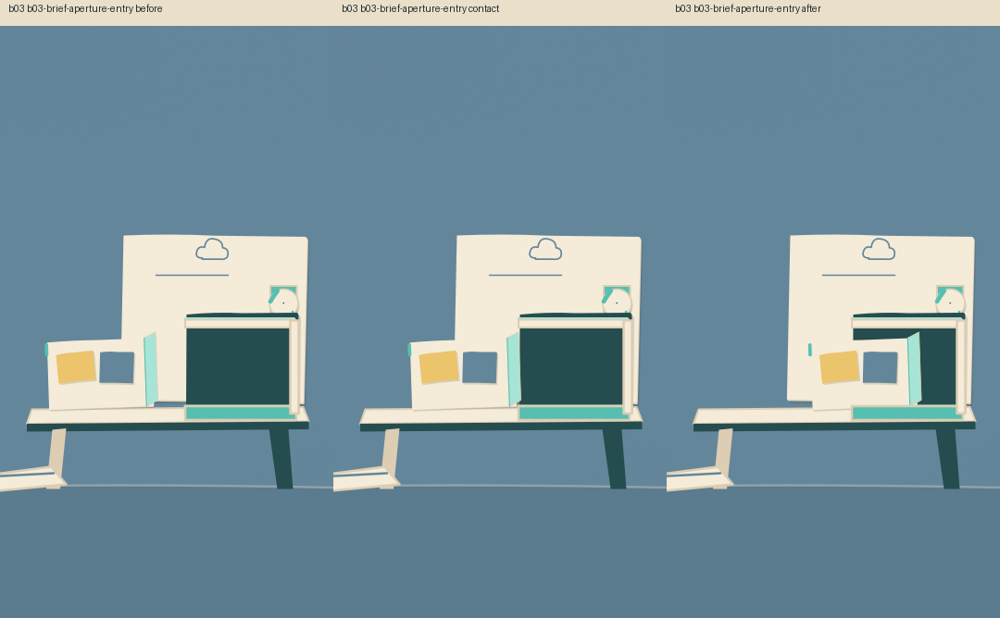
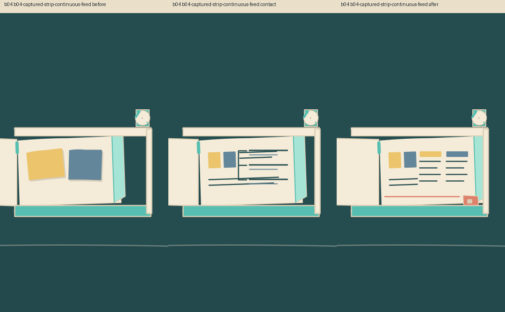

# Dots connected-work concept review

## Scope

Static concept delivery for original s02 / b02–b04 only. Exact existing narration is preserved. Eight previously passing setups and their beat contracts/previews are inherited unchanged. This does not grant new approval to their motion.

## Revised structure

The live scoped planner split the rejected compound deck into two setups:

1. **s02-app-access / b02:** the original Dot token contacts a fixed app terminal; joined marks at the contact region communicate connection.
2. **s02-cloud-process / b03–b04:** the Dot-owned computer captures one identifiable brief at its aperture. A tight recompose then prunes the body, earlier app mechanism and user device so one strip developing from source to outline to unfinished draft becomes the hero.

Motif Bot is absent in this span. Dot identity, the existing cream brief/raised mint corner/teal notch, and approved internal paper treatment are reused. The new app-terminal, cloud-aperture and job-strip art are three production-scoped, agent-assisted static families. Feed/masking/choreography adapters remain proposals; no runtime capability or full library has been implemented.

See [storyboard](CONNECTED_WORK_STORYBOARD.md), [plan](production-plan.json), [contract](concept-contract.json), and [asset/capability record](capability-resolution.json).

## Clean visual evidence

Each production frame is caption-free, native 360×640. Review labels appear outside the production frames. No diagnostic outlines can grant PASS.

### App connection

### Input into a separate computer

### Continued work

Additional [source-to-outline](review/concepts-v2/source-to-outline.png), [outline-to-draft](review/concepts-v2/outline-to-draft.png) and [inactive-user comparison](review/concepts-v2/work-with-user-inactive.png) are available. These are static states; continuous motion, timing and full-rate contact are unassessed.

[Revised setup sheet](review/concepts-v2/revised-setups.png) · [Full context with eight preserved setups](review/concepts-v2/full-context.png) · [Evidence manifest and all native frames](concept-evidence.json)

## Reference grounding per beat

| Beat | Retrieved setup IDs |
| --- | --- |
| b02 | Dd15NcHvlNl-s20, Dd15NcHvlNl-s14 |
| b03 | Dd45WmVPOfQ-s08, Dd15NcHvlNl-s13 |
| b04 | Dd2HMwIy6D3-s14, Dd2HMwIy6D3-s17 |

[Beat evidence map](beat-reference-map.json) records the actual ordered/dense frame IDs, timestamps, hashes and independent Director guidance. Private frame packages remain local in reference-calibration/. They guide hierarchy and evolving states; they are neither factual sources nor artwork. The Director explicitly marks physical contact/strip feed as unproved by these examples, requiring clean original proof and later motion review. No external reference pixels were copied into the assets.

## Completed review history

- The live semantic negative regression rejected the unchanged old deck with COMPOUND_VISUAL_RULE and ACTOR_AMBIGUITY, scoped to s02. [Evidence](validation/compound-negative/result.json).
- The first merged structure was rejected because shared metadata still required superseded machinery/Bot actions. The generic scoped merge was corrected to retire those active requirements while retaining locked-beat resources. The failed plan/report remain in structure-attempt-1/.
- The revised live structure review passes. [Structure report](quality-structure.json).
- Concept v1 failed: app contact hierarchy/scale, ambiguous entry state, and content swapping without clear strip travel. All v1 source/art/evidence and its completed critic are archived.
- One bounded v2 static repair enlarged the junction, widened the pre-entry gap, moved the actual strip identity edge through its states, and pruned secondary mechanisms. No third cosmetic pass is authorized after two repeated same-family failures.

## Verification and limits

102 implementation tests pass, including semantic failure coverage, proof integrity/native size, bounded scoped merge, deadlock counting and CLI schema handling. Implementation diff whitespace checks pass. Archived model JSON and reused identity source retain their original whitespace so their evidence hashes remain valid.

[Integrity record](integrity.json): 1,928 prior Dots files unchanged; 540 frozen gold/mascot files unchanged; seven source videos and 91 setup records retained; exact script and all eight inherited previews preserved. The corpus was reused without processing or uploading it again.

The live model backend is gpt-6.1-sol through the configured newer CLI. Invalid schema/tool-using responses and a capacity failure were retained as rejected attempts; none were used as planning output. This is not an autonomous finished-film result. Static artwork required agent assistance and one critic-led repair. No animation, moving rough, narration, final film or new factual verification was produced.

## Final concept verdict

**BLOCKED — concept deadlock.** The second live critic passes every app-access check and every cloud-process check except `CONTACT_PROOF_UNREADABLE`. [Actual critic](reference-gates/concept/concept-critic.json) · [Bound live record](reference-gates/concept/record.json).

The remaining failure is b03: the contact/after frames do not visibly establish the leading edge passing beneath a receiving lip, and the teal task notch appears detached from the paper afterward. The b04 samples do not resolve that capture relationship. The next proposal must establish attached identity and occlusion at the receiving surface, carry that capture into the process, and simplify/change archetype/split through a **fresh scoped replan**. It must not be a third cosmetic revision of this apparatus.

This family has two completed live reviews with the same contact failure. [Deadlock verification](deadlock-verification.json) confirms both that `require_stage` refuses concept approval and that `guard_deadlock` blocks a third cosmetic review. v1 and v2 completed critic receipts are archived in concept-history/. App-access passing evidence remains available; no further edits were made after the verdict.

The requested outcome is reached as a correctly blocked concept delivery. No animation or moving rough was started. Awaiting user review.
